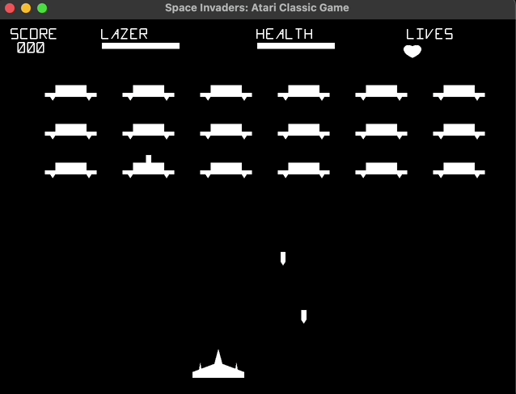
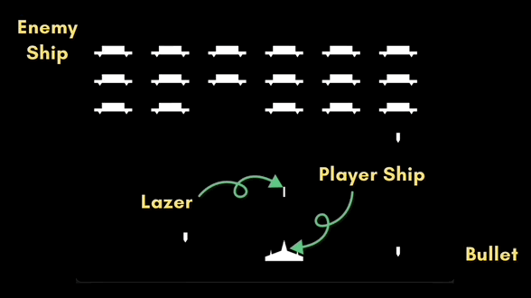
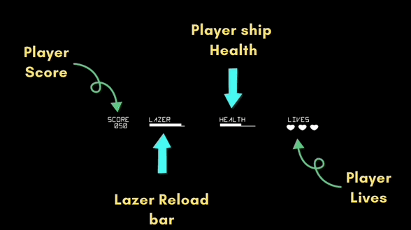
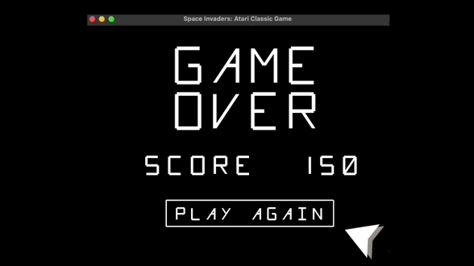

# Space Invaders Game

## Running the game
- Just setup GLFW and GLEW (header files required for OpenGL framework).
- run Main.cpp

#### OR
- Run the unix/MacOS executable provided in release.

## Game Demo

